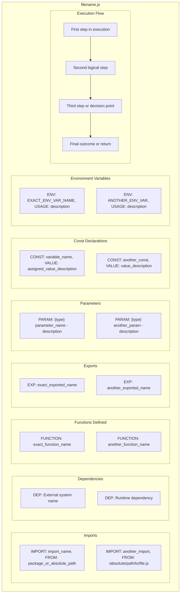
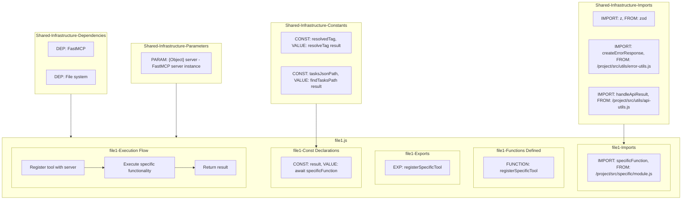
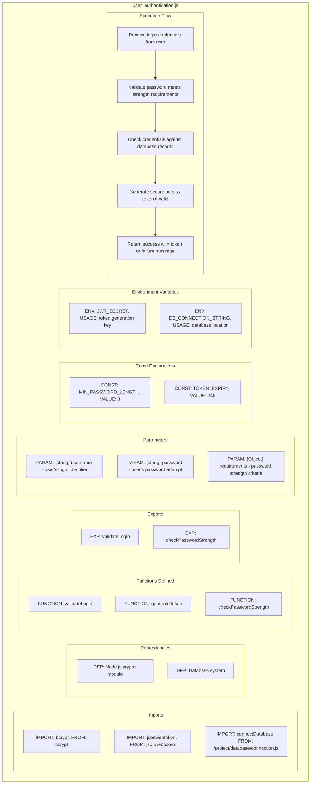

# LLM Instructions: Recursive Code Analysis with Layered Architecture Mermaid Diagrams

## Project Overview

Your task is to recursively analyze all files in a specified directory structure, create individual mermaid diagrams explaining each file in layperson terms, and then create comprehensive master diagrams showing both detailed file relationships and overall system architecture. This analysis is specifically designed for sophisticated layered architectures where the same functionality is implemented across multiple interface layers (CLI, MCP, direct functions) with shared infrastructure.

The goal is to help non-technical stakeholders understand both what individual files do and how the overall system architecture works across multiple layers.

## Configuration

### Target Directory to Analyze
```
TARGET_DIRECTORY: claude-task-master/
```

### Output Directories for Regular Generated Diagrams
```
SHARED_INFRASTRUCTURE_OUTPUT_DIRECTORY: claude-task-master\project-overlord-context\Mermaid-Diagrams\Shared-Infrastructure-Layer\
CORE_IMPLEMENTATION_OUTPUT_DIRECTORY: claude-task-master\project-overlord-context\Mermaid-Diagrams\Core-Implementation-Layer\
INTERFACE_LAYER_OUTPUT_DIRECTORY: claude-task-master\project-overlord-context\Mermaid-Diagrams\Interface-Layer\

```
### Output Directory for ALL Master Generated Diagrams
MASTER_DIAGRAM_OUTPUT_DIRECTORY: project-overlord-context\Mermaid-Diagrams\Master-Diagrams\

### Exclusion Lists

#### Directories to Exclude (Skip these directories entirely)
```
EXCLUDED_DIRECTORIES:
- node_modules
- .git
- dist
- build
- coverage
- __pycache__
- .pytest_cache
- .vscode
- .cursor
- assets
- docs
- context
- bin
- claude-task-master\mcp-server\src\core\__tests__
- .vscode
- .taskmaster
- .cursor
- .claude
- claude-task-master\assets
```

#### Files to Exclude (Skip these individual files)
```
EXCLUDED_FILES:
- .DS_Store
- .gitignore
- package-lock.json
- yarn.lock
- *.log
- *.tmp
- *.md
- *.json (except core config files)
- test-*.js
- *.test.js
- *README*
- package.json
- llms-install.md
- .mcp.json
- *.env*
- .cursorignore
- claude-task-master\scripts\task-complexity-report.json
- example_prd.txt

```

#### File Types to Include (Only process these file types)
```
INCLUDED_FILE_TYPES:
- .js
- .jsx
- .ts
- .tsx
- .py
- .java
- .cpp
- .c
- .cs
- .php
- .rb
- .go
- [ADD ADDITIONAL FILE EXTENSIONS TO PROCESS]
```

## Prerequisites and Setup

1. Ensure you can read and write files in the specified directories
2. Verify mermaid diagram syntax knowledge
3. Understand the target programming languages in the codebase
4. Create the output directory structure if it doesn't exist
5. Understand layered architecture patterns (interface layers, core implementations, shared infrastructure)

## Step-by-Step Process Instructions

### Phase 1: Directory Traversal and Architectural Discovery

1. **Recursively scan** the TARGET_DIRECTORY
2. **Apply exclusion filters** - skip any directories or files in the exclusion lists
3. **Identify architectural layers** by analyzing directory structure:
   - Interface layers (e.g., `mcp-server/src/tools/`, `cli/src/commands/`)
   - Core implementation layers (e.g., `core/`, `scripts/modules/`)
   - Shared infrastructure (e.g., `src/utils/`, `src/constants/`)
4. **Group files by architectural layer** for organized processing
5. **Create a complete inventory** of files to be processed with their absolute paths
6. **Note architectural relationships** - files with same names across layers
7. **Identify shared infrastructure** - utilities, constants, types used across layers

### Phase 2: Individual File Analysis and Diagram Creation

Ensure **each file** below was Identified, and assigned an Architectural Layer in Phase 1, perform the tasks in **File Analysis Requirements** onward. Indicate on the directory tree as each file is completed in-case it takes more than 1 session to accomplish.

CLAUDE-TASK-MASTER
 ┣ claude-task-master
 ┃  ┣ mcp-server
 ┃  ┃  ┣ src
 ┃  ┃  ┃  ┣ core
 ┃  ┃  ┃  ┃  ┣ direct-functions
 ┃  ┃  ┃  ┃  ┃  ┣ add-dependency.js
 ┃  ┃  ┃  ┃  ┃  ┣ add-subtask.js
 ┃  ┃  ┃  ┃  ┃  ┣ add-tag.js
 ┃  ┃  ┃  ┃  ┃  ┣ add-task.js
 ┃  ┃  ┃  ┃  ┃  ┣ analyze-task-complexity.js
 ┃  ┃  ┃  ┃  ┃  ┣ cache-stats.js
 ┃  ┃  ┃  ┃  ┃  ┣ clear-subtasks.js
 ┃  ┃  ┃  ┃  ┃  ┣ complexity-report.js
 ┃  ┃  ┃  ┃  ┃  ┣ copy-tag.js
 ┃  ┃  ┃  ┃  ┃  ┣ create-tag-from-branch.js
 ┃  ┃  ┃  ┃  ┃  ┣ delete-tag.js
 ┃  ┃  ┃  ┃  ┃  ┣ expand-all-tasks.js
 ┃  ┃  ┃  ┃  ┃  ┣ expand-task.js
 ┃  ┃  ┃  ┃  ┃  ┣ fix-dependencies.js
 ┃  ┃  ┃  ┃  ┃  ┣ generate-task-files.js
 ┃  ┃  ┃  ┃  ┃  ┣ initialize-project.js
 ┃  ┃  ┃  ┃  ┃  ┣ list-tags.js
 ┃  ┃  ┃  ┃  ┃  ┣ list-tasks.js
 ┃  ┃  ┃  ┃  ┃  ┣ models.js
 ┃  ┃  ┃  ┃  ┃  ┣ move-task.js
 ┃  ┃  ┃  ┃  ┃  ┣ next-task.js
 ┃  ┃  ┃  ┃  ┃  ┣ parse-prd.js
 ┃  ┃  ┃  ┃  ┃  ┣ remove-dependency.js
 ┃  ┃  ┃  ┃  ┃  ┣ remove-subtask.js
 ┃  ┃  ┃  ┃  ┃  ┣ remove-task.js
 ┃  ┃  ┃  ┃  ┃  ┣ rename-tag.js
 ┃  ┃  ┃  ┃  ┃  ┣ research.js
 ┃  ┃  ┃  ┃  ┃  ┣ response-language.js
 ┃  ┃  ┃  ┃  ┃  ┣ rules.js
 ┃  ┃  ┃  ┃  ┃  ┣ scope-down.js
 ┃  ┃  ┃  ┃  ┃  ┣ scope-up.js
 ┃  ┃  ┃  ┃  ┃  ┣ set-task-status.js
 ┃  ┃  ┃  ┃  ┃  ┣ show-task.js
 ┃  ┃  ┃  ┃  ┃  ┣ update-subtask-by-id.js
 ┃  ┃  ┃  ┃  ┃  ┣ update-task-by-id.js
 ┃  ┃  ┃  ┃  ┃  ┣ update-tasks.js
 ┃  ┃  ┃  ┃  ┃  ┣ use-tag.js
 ┃  ┃  ┃  ┃  ┃  ┗ validate-dependencies.js
 ┃  ┃  ┃  ┃  ┣ utils
 ┃  ┃  ┃  ┃  ┃  ┣ env-utils.js
 ┃  ┃  ┃  ┃  ┃  ┗ path-utils.js
 ┃  ┃  ┃  ┃  ┣ context-manager.js
 ┃  ┃  ┃  ┃  ┗ task-master-core.js
 ┃  ┃  ┃  ┣ custom-sdk
 ┃  ┃  ┃  ┃  ┣ errors.js
 ┃  ┃  ┃  ┃  ┣ index.js
 ┃  ┃  ┃  ┃  ┣ json-extractor.js
 ┃  ┃  ┃  ┃  ┣ language-model.js
 ┃  ┃  ┃  ┃  ┣ message-converter.js
 ┃  ┃  ┃  ┃  ┗ schema-converter.js
 ┃  ┃  ┃  ┣ providers
 ┃  ┃  ┃  ┃  ┗ mcp-provider.js
 ┃  ┃  ┃  ┣ tools
 ┃  ┃  ┃  ┃  ┣ add-dependency.js
 ┃  ┃  ┃  ┃  ┣ add-subtask.js
 ┃  ┃  ┃  ┃  ┣ add-tag.js
 ┃  ┃  ┃  ┃  ┣ add-task.js
 ┃  ┃  ┃  ┃  ┣ analyze.js
 ┃  ┃  ┃  ┃  ┣ clear-subtasks.js
 ┃  ┃  ┃  ┃  ┣ complexity-report.js
 ┃  ┃  ┃  ┃  ┣ copy-tag.js
 ┃  ┃  ┃  ┃  ┣ delete-tag.js
 ┃  ┃  ┃  ┃  ┣ expand-all.js
 ┃  ┃  ┃  ┃  ┣ expand-task.js
 ┃  ┃  ┃  ┃  ┣ fix-dependencies.js
 ┃  ┃  ┃  ┃  ┣ generate.js
 ┃  ┃  ┃  ┃  ┣ get-operation-status.js
 ┃  ┃  ┃  ┃  ┣ get-task.js
 ┃  ┃  ┃  ┃  ┣ get-tasks.js
 ┃  ┃  ┃  ┃  ┣ index.js
 ┃  ┃  ┃  ┃  ┣ initialize-project.js
 ┃  ┃  ┃  ┃  ┣ list-tags.js
 ┃  ┃  ┃  ┃  ┣ models.js
 ┃  ┃  ┃  ┃  ┣ move-task.js
 ┃  ┃  ┃  ┃  ┣ next-task.js
 ┃  ┃  ┃  ┃  ┣ parse-prd.js
 ┃  ┃  ┃  ┃  ┣ remove-dependency.js
 ┃  ┃  ┃  ┃  ┣ remove-subtask.js
 ┃  ┃  ┃  ┃  ┣ remove-task.js
 ┃  ┃  ┃  ┃  ┣ rename-tag.js
 ┃  ┃  ┃  ┃  ┣ research.js
 ┃  ┃  ┃  ┃  ┣ response-language.js
 ┃  ┃  ┃  ┃  ┣ rules.js
 ┃  ┃  ┃  ┃  ┣ scope-down.js
 ┃  ┃  ┃  ┃  ┣ scope-up.js
 ┃  ┃  ┃  ┃  ┣ set-task-status.js
 ┃  ┃  ┃  ┃  ┣ update-subtask.js
 ┃  ┃  ┃  ┃  ┣ update-task.js
 ┃  ┃  ┃  ┃  ┣ update.js
 ┃  ┃  ┃  ┃  ┣ use-tag.js
 ┃  ┃  ┃  ┃  ┣ utils.js
 ┃  ┃  ┃  ┃  ┗ validate-dependencies.js
 ┃  ┃  ┃  ┣ index.js
 ┃  ┃  ┃  ┗ logger.js
 ┃  ┃  ┗ server.js
 ┃  ┣ scripts
 ┃  ┃  ┣ modules
 ┃  ┃  ┃  ┣ task-manager
 ┃  ┃  ┃  ┃  ┣ add-subtask.js
 ┃  ┃  ┃  ┃  ┣ add-task.js
 ┃  ┃  ┃  ┃  ┣ analyze-task-complexity.js
 ┃  ┃  ┃  ┃  ┣ clear-subtasks.js
 ┃  ┃  ┃  ┃  ┣ expand-all-tasks.js
 ┃  ┃  ┃  ┃  ┣ expand-task.js
 ┃  ┃  ┃  ┃  ┣ find-next-task.js
 ┃  ┃  ┃  ┃  ┣ generate-task-files.js
 ┃  ┃  ┃  ┃  ┣ is-task-dependent.js
 ┃  ┃  ┃  ┃  ┣ list-tasks.js
 ┃  ┃  ┃  ┃  ┣ migrate.js
 ┃  ┃  ┃  ┃  ┣ models.js
 ┃  ┃  ┃  ┃  ┣ move-task.js
 ┃  ┃  ┃  ┃  ┣ parse-prd.js
 ┃  ┃  ┃  ┃  ┣ remove-subtask.js
 ┃  ┃  ┃  ┃  ┣ remove-task.js
 ┃  ┃  ┃  ┃  ┣ research.js
 ┃  ┃  ┃  ┃  ┣ response-language.js
 ┃  ┃  ┃  ┃  ┣ scope-adjustment.js
 ┃  ┃  ┃  ┃  ┣ set-task-status.js
 ┃  ┃  ┃  ┃  ┣ tag-management.js
 ┃  ┃  ┃  ┃  ┣ task-exists.js
 ┃  ┃  ┃  ┃  ┣ update-single-task-status.js
 ┃  ┃  ┃  ┃  ┣ update-subtask-by-id.js
 ┃  ┃  ┃  ┃  ┣ update-task-by-id.js
 ┃  ┃  ┃  ┃  ┗ update-tasks.js
 ┃  ┃  ┃  ┣ utils
 ┃  ┃  ┃  ┃  ┣ contextGatherer.js
 ┃  ┃  ┃  ┃  ┣ fuzzyTaskSearch.js
 ┃  ┃  ┃  ┃  ┗ git-utils.js
 ┃  ┃  ┃  ┣ ai-services-unified.js
 ┃  ┃  ┃  ┣ commands.js
 ┃  ┃  ┃  ┣ config-manager.js
 ┃  ┃  ┃  ┣ dependency-manager.js
 ┃  ┃  ┃  ┣ index.js
 ┃  ┃  ┃  ┣ prompt-manager.js
 ┃  ┃  ┃  ┣ supported-models.json
 ┃  ┃  ┃  ┣ sync-readme.js
 ┃  ┃  ┃  ┣ task-manager.js
 ┃  ┃  ┃  ┣ ui.js
 ┃  ┃  ┃  ┣ update-config-tokens.js
 ┃  ┃  ┃  ┗ utils.js
 ┃  ┃  ┣ dev.js
 ┃  ┃  ┣ init.js
 ┃  ┃  ┗ task-complexity-report.json
 ┃  ┣ src
 ┃  ┃  ┣ ai-providers
 ┃  ┃  ┃  ┣ custom-sdk
 ┃  ┃  ┃  ┃  ┗ claude-code
 ┃  ┃  ┃  ┃     ┣ errors.js
 ┃  ┃  ┃  ┃     ┣ index.js
 ┃  ┃  ┃  ┃     ┣ json-extractor.js
 ┃  ┃  ┃  ┃     ┣ language-model.js
 ┃  ┃  ┃  ┃     ┣ message-converter.js
 ┃  ┃  ┃  ┃     ┗ types.js
 ┃  ┃  ┃  ┣ anthropic.js
 ┃  ┃  ┃  ┣ base-provider.js
 ┃  ┃  ┃  ┣ claude-code.js
 ┃  ┃  ┃  ┣ gemini-cli.js
 ┃  ┃  ┃  ┣ google-vertex.js
 ┃  ┃  ┃  ┣ google.js
 ┃  ┃  ┃  ┣ index.js
 ┃  ┃  ┃  ┣ ollama.js
 ┃  ┃  ┃  ┣ openai.js
 ┃  ┃  ┃  ┣ openrouter.js
 ┃  ┃  ┃  ┗ perplexity.js
 ┃  ┃  ┣ constants
 ┃  ┃  ┃  ┣ commands.js
 ┃  ┃  ┃  ┣ paths.js
 ┃  ┃  ┃  ┣ profiles.js
 ┃  ┃  ┃  ┣ providers.js
 ┃  ┃  ┃  ┣ rules-actions.js
 ┃  ┃  ┃  ┣ task-priority.js
 ┃  ┃  ┃  ┗ task-status.js
 ┃  ┃  ┣ profiles
 ┃  ┃  ┃  ┣ base-profile.js
 ┃  ┃  ┃  ┣ claude.js
 ┃  ┃  ┃  ┣ cline.js
 ┃  ┃  ┃  ┣ codex.js
 ┃  ┃  ┃  ┣ cursor.js
 ┃  ┃  ┃  ┣ gemini.js
 ┃  ┃  ┃  ┣ index.js
 ┃  ┃  ┃  ┣ roo.js
 ┃  ┃  ┃  ┗ vscode.js
 ┃  ┃  ┣ prompts
 ┃  ┃  ┃  ┣ schemas
 ┃  ┃  ┃  ┃  ┣ parameter.schema.json
 ┃  ┃  ┃  ┃  ┣ prompt-template.schema.json
 ┃  ┃  ┃  ┃  ┗ variant.schema.json
 ┃  ┃  ┃  ┣ add-task.json
 ┃  ┃  ┃  ┣ analyze-complexity.json
 ┃  ┃  ┃  ┣ expand-task.json
 ┃  ┃  ┃  ┣ parse-prd.json
 ┃  ┃  ┃  ┣ research.json
 ┃  ┃  ┃  ┣ update-subtask.json
 ┃  ┃  ┃  ┣ update-task.json
 ┃  ┃  ┃  ┗ update-tasks.json
 ┃  ┃  ┣ provider-registry
 ┃  ┃  ┃  ┗ index.js
 ┃  ┃  ┣ utils
 ┃  ┃  ┃  ┣ create-mcp-config.js
 ┃  ┃  ┃  ┣ getVersion.js
 ┃  ┃  ┃  ┣ logger-utils.js
 ┃  ┃  ┃  ┣ manage-gitignore.js
 ┃  ┃  ┃  ┣ path-utils.js
 ┃  ┃  ┃  ┣ profiles.js
 ┃  ┃  ┃  ┗ rule-transformer.js
 ┃  ┃  ┗ task-master.js
 ┃  ┣ .mcp.json
 ┃  ┣ index.js


#### File Analysis Requirements

Analyze each file to extract:

1. **Imported Packages/Functions**: All external dependencies, libraries, and functions imported from other files
   - **CRITICAL**: For relative imports (starting with ./ or ../), resolve the full absolute path
   - **Keep external package imports as-is** (e.g., from 'react', 'express', 'zod')
   - **Example**: `../utils/logger.js` from file at `/project/src/components/header.js` should resolve to `/project/src/utils/logger.js`
2. **Functions Defined**: ONLY functions actually defined in the current file (not imported functions)
3. **Exports**: All functions, variables, classes, or modules exported from the file
4. **Parameters**: Include ONLY JSDoc @param annotations from function definitions
5. **Constants Defined**: ONLY actual const declarations in the file
6. **Environment Variables**: Any environment variables accessed or used
7. **Execution Flow**: The logical sequence of operations performed by the file

#### Individual File Diagram Specifications

Create a mermaid flowchart diagram for each file with the following structure:



**CRITICAL FORMATTING RULES:**

1. **Imports**: Use exact import names and resolve relative paths to absolute paths for internal files
   - **External packages**: `["IMPORT: import_name, FROM: package_name"]`
     - Example: `["IMPORT: z, FROM: zod"]`
   - **Internal project files**: `["IMPORT: import_name, FROM: /absolute/path/to/file.js"]`
     - Example: `["IMPORT: createLogger, FROM: /project/src/utils/logger.js"]`
   - **This ensures accurate relationship mapping in the master diagram**

2. **Dependencies**: External systems, frameworks, or runtime dependencies not directly imported
   - Format: `["DEP: System or framework name"]`
   - Example: `["DEP: FastMCP"]` or `["DEP: File system"]`

3. **Functions**: List ONLY functions actually defined in the current file (not imported functions)
   - Format: `["FUNCTION: exact_function_name"]`
   - Example: `["FUNCTION: registerCacheStatsTool"]` or `["FUNCTION: validateUser"]`

4. **Exports**: List exact exported names
   - Format: `["EXP: exact_exported_name"]`
   - Example: `["EXP: registerCacheStatsTool"]` or `["EXP: UserController"]`

5. **Parameters**: Include ONLY JSDoc @param annotations from function definitions
   - Format: `["PARAM: {type} parameter_name - description"]`
   - Example: `["PARAM: {Object} server - FastMCP server instance"]`

6. **Constants**: Include ONLY actual const declarations in the file
   - Format: `["CONST: variable_name, VALUE: assigned_value_or_description"]`
   - Example: `["CONST: result, VALUE: await addTagDirect"]`

7. **Environment Variables**: List exact variable names used in the file
   - Format: `["ENV: ENV_VAR_NAME, USAGE: description"]`
   - Example: `["ENV: DATABASE_URL, USAGE: database connection string"]`

8. **Execution Flow**: Show logical progression with flow arrows
   - Format: `["Description of step"]`
   - Example: `["Register tool with server using name and description"]`
   - **Include flow arrows**: `FL1 --> FL2` etc.

**SUBGRAPH INCLUSION RULES:**
- **Only include subgraphs that contain actual data from the file**
- **If a file has no const declarations, omit the Constants subgraph entirely**
- **If a file has no @param annotations, omit the Parameters subgraph**
- **If a file has no environment variables, omit that subgraph**
- **Be precise - only include what actually exists in the code**

#### Layperson Language Requirements

**IMPORTANT**: The layperson language requirement applies to **descriptions and explanations**, NOT to the structural data elements:

**✅ CORRECT - Keep exact names/paths for structural elements:**
- Imports: `["IMPORT: z, FROM: zod"]`, `["IMPORT: createLogger, FROM: /project/src/utils/logger.js"]`
- Functions: `["FUNCTION: registerCacheStatsTool"]`, `["FUNCTION: validateUserCredentials"]`
- Exports: `["EXP: UserController"]`, `["EXP: calculateTax"]`
- Constants: `["CONST: API_TIMEOUT, VALUE: maximum time to wait for server response"]`

**❌ WRONG - Don't translate structural names:**
- ❌ `["validation library from zod package"]`
- ❌ `["user registration process"]`
- ❌ `["makes user management available"]`

**✅ CORRECT - Use layperson language for descriptions:**
- Parameter descriptions: `["PARAM: {number} income - user's annual earnings in dollars"]`
- Constant purposes: `["CONST: MAX_RETRIES, VALUE: maximum number of connection attempts before giving up"]`
- Flow steps: `["Validate user provided the required login information"]`
- Dependencies: `["DEP: Express web server framework for handling HTTP requests"]`

The goal is to keep technical identifiers exact for mapping purposes, while making their purposes and relationships understandable to non-technical stakeholders.

#### File Naming Convention

Save each diagram as: `[ORIGINAL_FILENAME]_diagram.mmd`

Examples:
- `app.js` → `app.js_diagram.mmd`
- `UserController.py` → `UserController.py_diagram.mmd`
- `components/Header.tsx` → `Header.tsx_diagram.mmd`

#### Directory Structure Preservation

Maintain the original directory structure in your output:
- If analyzing `src/components/Header.tsx`, save as `OUTPUT_DIRECTORY/src/components/Header.tsx_diagram.mmd`

### Phase 3: Layered Master Diagram Creation

After completing all individual file diagrams, create multiple master diagrams organized by architectural layers.

#### Layer-Based Master Diagram Strategy

**1. Identify Architectural Layers** from directory structure:
- Interface layers (MCP tools, CLI commands, API endpoints)
- Core implementation layers (direct functions, business logic)
- Shared infrastructure (utilities, constants, types)

**2. Create Layer-Specific Master Diagrams:**
- `[layer-name]-master.mmd` for each identified layer
- Use the detailed approach showing individual files with shared infrastructure sections
- Must Include All Subgraphs in Master even if they contain no data.

**3. Create System Architecture Overview:**
- `system-architecture-master.mmd` showing how layers connect at high level

#### Detailed Layer Master Diagram Format

For each layer, create a master diagram using this approach:



#### Master Diagram Requirements

Each layer master diagram must show:

1. **Shared Infrastructure Sections** - Common imports, dependencies, parameters, constants used across files in the layer
2. **Individual File Sections** - Each file's unique elements (imports, functions, exports, constants, execution flow)
3. **Relationship Mapping** - Clear connections showing what's shared vs. unique
4. **Cross-Layer Relationships** - How this layer connects to other layers (shown via imports)
5. **Architectural Patterns** - How files in the layer follow consistent patterns

#### System Architecture Overview Requirements

Create one high-level diagram showing:
- All architectural layers as major subgraphs
- Interface relationships between layers
- Shared infrastructure usage across layers
- Data flow between layers
- External system dependencies

## Output Specifications

### Required Output Files

1. **Individual diagrams**: One `.mmd` file for each analyzed source file
2. **Layer master diagrams**: One master diagram per architectural layer
3. **System architecture overview**: `system-architecture-master.mmd` showing layer relationships
4. **Analysis summary**: `analysis_summary.md` with:
   - Total files processed by layer
   - Files skipped (and reasons)
   - Architectural layer analysis
   - Shared infrastructure summary
   - Cross-layer relationship patterns
   - Key architectural insights

### File Content Requirements

Each `.mmd` file must:
- Be valid mermaid syntax with properly quoted node names containing special characters
- Use exact technical names for structural elements (imports, functions, exports, constants)
- Use layperson language for descriptions and explanations
- Include only subgraphs that contain actual data (omit empty sections)
- Follow consistent labeling: I1, I2... for imports, D1, D2... for dependencies, etc.
- Include Execution Flow subgraph showing the logical steps of the file
- Be properly formatted and readable

**CRITICAL MERMAID SYNTAX RULE:**
All node names containing special characters (hyphens, slashes, periods, spaces, etc.) must be wrapped in double quotes:
- ✅ `EXT1["/project/src/utils/logger.js"]`
- ✅ `FILE1["add-subtask.js - Adds subtasks to existing tasks"]`
- ❌ `EXT1[/project/src/utils/logger.js]`
- ❌ `FILE1[add-subtask.js - Adds subtasks to existing tasks]`

## Validation and Completion Steps

Before considering the task complete:

1. **Verify all source files were processed** - check that no files were missed
2. **Validate mermaid syntax** - ensure all diagrams are syntactically correct with proper quoting
3. **Check relationship accuracy** - verify that master diagrams correctly represent all file relationships
4. **Review architectural mapping** - confirm that layer organization reflects actual system architecture
5. **Validate shared infrastructure identification** - ensure common elements are properly grouped
6. **Test cross-layer relationships** - verify that interface patterns are correctly mapped
7. **Review language usage** - confirm all technical terms were handled appropriately

## Error Handling

If you encounter:

- **Unreadable files**: Skip and note in analysis summary
- **Binary files**: Skip automatically
- **Parsing errors**: Note the issue and continue with other files
- **Unknown file types**: Skip unless explicitly included
- **Permission errors**: Skip and document
- **Complex architectural patterns**: Document and explain in summary

## Progress Reporting

Provide regular updates on:
- Current layer being processed
- Number of files completed vs. total per layer
- Architectural patterns discovered
- Any issues encountered
- Estimated completion time

## Final Deliverables Checklist

- [ ] All individual file diagrams created
- [ ] Layer-specific master diagrams created for each architectural layer
- [ ] System architecture overview diagram completed
- [ ] Analysis summary document completed with architectural insights
- [ ] All files use appropriate language (exact names for structure, layperson for descriptions)
- [ ] Directory structure preserved in output
- [ ] No syntax errors in mermaid files (proper quoting applied)
- [ ] Relationships accurately mapped in all master diagrams
- [ ] Excluded files/directories properly skipped
- [ ] Architectural patterns clearly documented
- [ ] Cross-layer relationships properly identified

## Example Template

Here's a template for a typical file analysis:



Begin processing when ready. Start with Phase 1: Directory Traversal and Architectural Discovery, paying special attention to identifying the layered architecture patterns in the codebase.