# Project Handoff: LLM Code Analysis & Mermaid Diagram Generation

## Project Overview

**Objective:** Create a comprehensive system for LLM-driven recursive code analysis that generates mermaid diagrams explaining complex layered architectures to non-technical stakeholders.

**Target Scope:** 200+ files across a sophisticated 3-layer architecture (claude-task-master project)

**Key Innovation:** Diagrams serve dual purpose - detailed implementation understanding AND architectural pattern visualization.

**Key DIRECTORY/FILE NAMES:claude-task-master\project-overlord-context\Mermaid-Diagrams
MCP_INTERFACE_DIRECTORY: .\claude-task-master\project-overlord-context\Mermaid-Diagrams\MCP-Interface\

MCP_INTERFACE_MASTER: .\claude-task-master\project-overlord-context\Mermaid-Diagrams\MCP-Interface\MCP-Interface-Master.mmd

CORE_IMPLEMENTATION_DIRECTORY: .\claude-task-master\project-overlord-context\Mermaid-Diagrams\Core-Implementation\

CORE_IMPLEMENTATION_MASTER: .\claude-task-master\project-overlord-context\Mermaid-Diagrams\Core-Implementation\Core-Implementation-Master.mmd

TASK_MANAGER_DIRECTORY:.\claude-task-master\project-overlord-context\Mermaid-Diagrams\Task-Manager\

TASK_MANAGER_MASTER:.\claude-task-master\project-overlord-context\Mermaid-Diagrams\Task-Manager\Task-Manager-Master.mmd

SHARED_INFRASTRUCTURE_DIRECTORY: .\claude-task-master\project-overlord-context\Mermaid-Diagrams\Shared-Infrastructure\

SHARED_INFRASTRUCTURE_MASTER:.\claude-task-master\project-overlord-context\Mermaid-Diagrams\Shared-Infrastructure-Layer\Shared-Infrastructure-Master.mmd

SYSTEM_ARCHITECTURE_MASTER: .\claude-task-master\project-overlord-context\Mermaid-Diagrams\System-Architecture-Master.mmd

1. `mcp-interface-master.mmd` - All MCP wrapper tools
2. `core-implementation-master.mmd` - All direct function implementations  
3. `task-manager-master.mmd` - All core business logic
4. `shared-infrastructure-master.mmd` - Common utilities and constants
5. `system-architecture-overview.mmd` - How layers connect
## What We've Accomplished

### 1. Comprehensive Instructions Document ✅
- **Location**: Updated in artifacts as "LLM Instructions: Recursive Code Analysis with Layered Architecture Mermaid Diagrams"
- **Status**: Complete and validated through real-world testing
- **Key Features**:
  - Handles complex layered architectures
  - Path resolution for relative imports
  - Precise technical element extraction
  - "Project overlord" approach for master diagrams
  - Mermaid syntax requirements with proper quoting

### 2. Validated Diagram Format ✅
**Individual File Format** (flowchart TB):
```mermaid
flowchart TB
    subgraph {Filename}-Imports["{FileName}-Imports"]
        I1["IMPORT: functionName, FROM: /absolute/path/to/file.js"]
    end
    subgraph {Filename}-Dependencies["{Filename}-Dependencies"]
        D1["DEP: System name"]
    end
    subgraph {Filename}-FunctionsDefined["{Filename}-Functions Defined"]
        FU1["FUNCTION: exactFunctionName"]
    end
    subgraph {Filename}-Exports["{Filename}-Exports"]
        E1["EXP: exactExportName"]
    end
    subgraph {Filename}-Parameters["{Filename}-Parameters"]
        P1["PARAM: {type} name - description"]
    end
    subgraph {Filename}-Constants["{Filename}-ConstDeclarations"]
        C1["CONST: varName, VALUE: description"]
    end
    subgraph {Filename}-ExecutionFlow["{Filename}-Execution Flow"]
        FL1["Step description"]
        FL2["Next step"]
    end
    subgraph FileName["filename.js"]
        {Filename}-Imports
        {Filename}-Dependencies
        {Filename}-FunctionsDefined
        {Filename}-Exports
        {Filename}-Parameters
        {Filename}-Constants
        {Filename}-ExecutionFlow
    end
    FL1 --> FL2
```

### 3. Architecture Discovery ✅
**Identified 3-Layer Architecture:**
- **MCP Interface Layer**: `mcp-server/src/tools/` (40+ tool wrappers)
- **Core Implementation Layer**: `mcp-server/src/core/direct-functions/` (40+ direct functions)
- **Task Manager Layer**: `scripts/modules/task-manager/` (30+ core business logic)
- **Shared Infrastructure**: `scripts/modules/utils.js`, config management, etc.

### 4. Real-World Validation ✅
**Successfully Analyzed Files:**
- `add-subtask.js`, `update-subtask.js`, `add-tag.js`, `cache-stats.js` (initial test cases)
- 40+ files from core implementation layer (provided in documents)
- All follow exact format requirements and show architectural patterns

## Critical Format Requirements (MUST FOLLOW)

### Technical Element Extraction Rules
1. **Functions**: ONLY actual function definitions in the file (not imported functions)
2. **Parameters**: ONLY JSDoc `@param` annotations from function signatures
3. **Constants**: ONLY actual `const` declarations found in code
4. **Imports**: MUST Resolve relative paths to absolute paths for internal files
5. **Empty Subgraphs**: Omit entirely (never show "None used")

### Mermaid Syntax Requirements
- **Format**: `flowchart TB` with proper subgraph structure
- **Node Names**: Quote ALL names with special characters: `["file-name.js"]`
- **Flow Arrows**: Use `FL1 --> FL2` for execution sequence
- **Labeling**: Consistent I1, I2... D1, D2... FU1, FU2... etc.

### Import Path Resolution
- **External packages**: `["IMPORT: z, FROM: zod"]`
- **Internal files**: `["IMPORT: createLogger, FROM: /project/src/utils/logger.js"]`
- **Critical**: Resolve `../utils/logger.js` to absolute path for master diagram accuracy

## Key Insights & Decisions

### The "Project Overlord" Master Diagram Approach
**Winner**: Detailed approach showing individual files + shared infrastructure sections
- Preserves all analytical detail
- Shows architectural patterns clearly
- Better for 200+ file scale than traditional high-level overview
- Maps to real architectural layers in the project

### Master Diagram Strategy
Create **layer-specific master diagrams**:
1. `mcp-interface-master.mmd` - All MCP wrapper tools
2. `core-implementation-master.mmd` - All direct function implementations  
3. `task-manager-master.mmd` - All core business logic
4. `shared-infrastructure-master.mmd` - Common utilities and constants
5. `system-architecture-overview.mmd` - How layers connect

### Architecture Pattern Recognition
The "project overlord" sections aren't arbitrary - they map to **real architectural layers**:
- Same function names across 3 layers (MCP wrapper → direct function → core logic)
- Shared infrastructure used by all layers
- Clear separation of concerns and dependency patterns

## What's Next (Immediate Priorities)

### Phase 1: Complete Individual File Analysis
**Exact Directory Structur & Files to Process** (~150+ files):
- Because there are 3 Layers containing identically named files, when naming diagram files this pattern must be used: {file_directory, file_name}.  Example:
For the file with full path: CLAUDE-TASK-MASTER/claude-task-master/mcp-server/src/core/direct-functions/add-dependency.js -> direct-functions/add-dependency, 
Alternatively for the file with path CLAUDE-TASK-MASTER/claude-task-master/mcp-server/src/core/tools/add-dependency.js -> tools/add-dependency, this 
allows to keep the 3 layers identifiable.

CLAUDE-TASK-MASTER
 ┣ claude-task-master
 ┃  ┣ mcp-server
 ┃  ┃  ┣ src
 ┃  ┃  ┃  ┣ core
 ┃  ┃  ┃  ┃  ┣ direct-functions
 ┃  ┃  ┃  ┃  ┃  ┣ add-dependency.js  - DONE
 ┃  ┃  ┃  ┃  ┃  ┣ add-subtask.js  - DONE
 ┃  ┃  ┃  ┃  ┃  ┣ add-task.js  - DONE
 ┃  ┃  ┃  ┃  ┃  ┣ analyze-task-complexity.js  - DONE
 ┃  ┃  ┃  ┃  ┃  ┣ cache-stats.js  - DONE
 ┃  ┃  ┃  ┃  ┃  ┣ clear-subtasks.js  - DONE
 ┃  ┃  ┃  ┃  ┃  ┣ complexity-report.js  - DONE
 ┃  ┃  ┃  ┃  ┃  ┣ copy-tag.js  - DONE
 ┃  ┃  ┃  ┃  ┃  ┣ create-tag-from-branch.js  - DONE
 ┃  ┃  ┃  ┃  ┃  ┣ delete-tag.js  - DONE
 ┃  ┃  ┃  ┃  ┃  ┣ expand-all-tasks.js - DONE
 ┃  ┃  ┃  ┃  ┃  ┣ expand-task.js - DONE
 ┃  ┃  ┃  ┃  ┃  ┣ fix-dependencies.js - DONE
 ┃  ┃  ┃  ┃  ┃  ┣ generate-task-files.js - DONE
 ┃  ┃  ┃  ┃  ┃  ┣ initialize-project.js - DONE
 ┃  ┃  ┃  ┃  ┃  ┣ list-tags.js - DONE
 ┃  ┃  ┃  ┃  ┃  ┣ list-tasks.js  - DONE
 ┃  ┃  ┃  ┃  ┃  ┣ models.js - DONE
 ┃  ┃  ┃  ┃  ┃  ┣ move-task.js - DONE
 ┃  ┃  ┃  ┃  ┃  ┣ next-task.js - DONE
 ┃  ┃  ┃  ┃  ┃  ┣ parse-prd.js - DONE
 ┃  ┃  ┃  ┃  ┃  ┣ remove-dependency.js - DONE
 ┃  ┃  ┃  ┃  ┃  ┣ remove-subtask.js - DONE
 ┃  ┃  ┃  ┃  ┃  ┣ remove-task.js - DONE
 ┃  ┃  ┃  ┃  ┃  ┣ rename-tag.js - DONE
 ┃  ┃  ┃  ┃  ┃  ┣ research.js - DONE
 ┃  ┃  ┃  ┃  ┃  ┣ response-language.js - DONE
 ┃  ┃  ┃  ┃  ┃  ┣ rules.js - DONE
 ┃  ┃  ┃  ┃  ┃  ┣ scope-down.js - DONE
 ┃  ┃  ┃  ┃  ┃  ┣ scope-up.js - DONE
 ┃  ┃  ┃  ┃  ┃  ┣ set-task-status.js - DONE
 ┃  ┃  ┃  ┃  ┃  ┣ show-task.js - DONE
 ┃  ┃  ┃  ┃  ┃  ┣ update-subtask-by-id.js - DONE
 ┃  ┃  ┃  ┃  ┃  ┣ update-task-by-id.js - DONE
 ┃  ┃  ┃  ┃  ┃  ┣ update-tasks.js - DONE
 ┃  ┃  ┃  ┃  ┃  ┣ use-tag.js - DONE
 ┃  ┃  ┃  ┃  ┃  ┗ validate-dependencies.js - DONE
 ┃  ┃  ┃  ┃  ┣ utils
 ┃  ┃  ┃  ┃  ┃  ┃  ┣ env-utils.js  - DONE
 ┃  ┃  ┃  ┃  ┃  ┗ path-utils.js - DONE
 ┃  ┃  ┃  ┃  ┣ context-manager.js  - DONE
 ┃  ┃  ┃  ┃  ┗ task-master-core.js  - DONE
 ┃  ┃  ┃  ┣ custom-sdk
 ┃  ┃  ┃  ┃  ┣ errors.js - DONE
 ┃  ┃  ┃  ┃  ┣ index.js - DONE
 ┃  ┃  ┃  ┃  ┣ json-extractor.js - DONE
 ┃  ┃  ┃  ┃  ┣ language-model.js - DONE
 ┃  ┃  ┃  ┃  ┣ message-converter.js - DONE
 ┃  ┃  ┃  ┃  ┗ schema-converter.js - DONE
 ┃  ┃  ┃  ┣ providers
 ┃  ┃  ┃  ┃  ┗ mcp-provider.js - DONE
 ┃  ┃  ┃  ┣ tools
 ┃  ┃  ┃  ┃  ┣ add-dependency.js  - DONE
 ┃  ┃  ┃  ┃  ┣ add-subtask.js  - DONE
 ┃  ┃  ┃  ┃  ┣ add-tag.js  - DONE
 ┃  ┃  ┃  ┃  ┣ add-task.js  - DONE
 ┃  ┃  ┃  ┃  ┣ analyze.js  - DONE
 ┃  ┃  ┃  ┃  ┣ clear-subtasks.js  - DONE
 ┃  ┃  ┃  ┃  ┣ complexity-report.js  - DONE
 ┃  ┃  ┃  ┃  ┣ copy-tag.js  - DONE
 ┃  ┃  ┃  ┃  ┣ delete-tag.js  - DONE
 ┃  ┃  ┃  ┃  ┣ expand-all.js  - DONE
 ┃  ┃  ┃  ┃  ┣ expand-task.js - DONE
 ┃  ┃  ┃  ┃  ┣ fix-dependencies.js - DONE
 ┃  ┃  ┃  ┃  ┣ generate.js - DONE
 ┃  ┃  ┃  ┃  ┣ get-operation-status.js - DONE
 ┃  ┃  ┃  ┃  ┣ get-task.js - DONE
 ┃  ┃  ┃  ┃  ┣ get-tasks.js  - DONE
 ┃  ┃  ┃  ┃  ┣ index.js  - DONE
 ┃  ┃  ┃  ┃  ┣ initialize-project.js - DONE
 ┃  ┃  ┃  ┃  ┣ list-tags.js - DONE
 ┃  ┃  ┃  ┃  ┣ models.js - DONE
 ┃  ┃  ┃  ┃  ┣ move-task.js - DONE
 ┃  ┃  ┃  ┃  ┣ next-task.js - DONE
 ┃  ┃  ┃  ┃  ┣ parse-prd.js - DONE
 ┃  ┃  ┃  ┃  ┣ remove-dependency.js - DONE
 ┃  ┃  ┃  ┃  ┣ remove-subtask.js - DONE
 ┃  ┃  ┃  ┃  ┣ remove-task.js - DONE
 ┃  ┃  ┃  ┃  ┣ rename-tag.js - DONE
 ┃  ┃  ┃  ┃  ┣ research.js - DONE
 ┃  ┃  ┃  ┃  ┣ response-language.js - DONE
 ┃  ┃  ┃  ┃  ┣ rules.js - DONE
 ┃  ┃  ┃  ┃  ┣ scope-down.js - DONE
 ┃  ┃  ┃  ┃  ┣ scope-up.js - DONE
 ┃  ┃  ┃  ┃  ┣ set-task-status.js - DONE
 ┃  ┃  ┃  ┃  ┣ update-subtask.js - DONE
 ┃  ┃  ┃  ┃  ┣ update-task.js - DONE
 ┃  ┃  ┃  ┃  ┣ update.js - DONE
 ┃  ┃  ┃  ┃  ┣ use-tag.js - DONE
 ┃  ┃  ┃  ┃  ┣ utils.js  - DONE
 ┃  ┃  ┃  ┃  ┗ validate-dependencies.js - DONE
 ┃  ┃  ┃  ┣ index.js - DONE
 ┃  ┃  ┃  ┗ logger.js - DONE
 ┃  ┃  ┗ server.js - DONE 
 ┃  ┣ scripts
 ┃  ┃  ┣ modules
 ┃  ┃  ┃  ┣ task-manager
 ┃  ┃  ┃  ┃  ┣ add-subtask.js  - DONE
 ┃  ┃  ┃  ┃  ┣ add-task.js  - DONE
 ┃  ┃  ┃  ┃  ┣ analyze-task-complexity.js  - DONE
 ┃  ┃  ┃  ┃  ┣ clear-subtasks.js  - DONE
 ┃  ┃  ┃  ┃  ┣ expand-all-tasks.js  - DONE
 ┃  ┃  ┃  ┃  ┣ expand-task.js  - DONE
 ┃  ┃  ┃  ┃  ┣ find-next-task.js - DONE
 ┃  ┃  ┃  ┃  ┣ generate-task-files.js - DONE
 ┃  ┃  ┃  ┃  ┣ is-task-dependent.js - DONE
 ┃  ┃  ┃  ┃  ┣ list-tasks.js  - DONE
 ┃  ┃  ┃  ┃  ┣ migrate.js - DONE
 ┃  ┃  ┃  ┃  ┣ models.js - DONE
 ┃  ┃  ┃  ┃  ┣ move-task.js - DONE
 ┃  ┃  ┃  ┃  ┣ parse-prd.js - DONE
 ┃  ┃  ┃  ┃  ┣ remove-subtask.js - DONE
 ┃  ┃  ┃  ┃  ┣ remove-task.js - DONE
 ┃  ┃  ┃  ┃  ┣ research.js - DONE
 ┃  ┃  ┃  ┃  ┣ response-language.js - DONE
 ┃  ┃  ┃  ┃  ┣ scope-adjustment.js - DONE
 ┃  ┃  ┃  ┃  ┣ set-task-status.js - DONE
 ┃  ┃  ┃  ┃  ┣ tag-management.js - DONE
 ┃  ┃  ┃  ┃  ┣ task-exists.js - DONE
 ┃  ┃  ┃  ┃  ┣ update-single-task-status.js - DONE
 ┃  ┃  ┃  ┃  ┣ update-subtask-by-id.js - DONE
 ┃  ┃  ┃  ┃  ┣ update-task-by-id.js - DONE
 ┃  ┃  ┃  ┃  ┗ update-tasks.js - DONE
 ┃  ┃  ┃  ┣ utils
 ┃  ┃  ┃  ┃  ┣ contextGatherer.js - DONE
 ┃  ┃  ┃  ┃  ┣ fuzzyTaskSearch.js - DONE
 ┃  ┃  ┃  ┃  ┗ git-utils.js - DONE
 ┃  ┃  ┃  ┣ ai-services-unified.js  - DONE
 ┃  ┃  ┃  ┣ commands.js  - DONE
 ┃  ┃  ┃  ┣ config-manager.js  - DONE
 ┃  ┃  ┃  ┣ dependency-manager.js  - DONE
 ┃  ┃  ┃  ┣ index.js  - DONE
 ┃  ┃  ┃  ┣ prompt-manager.js  - DONE
 ┃  ┃  ┃  ┣ supported-models.json - DONE
 ┃  ┃  ┃  ┣ sync-readme.js - DONE
 ┃  ┃  ┃  ┣ task-manager.js  - DONE
 ┃  ┃  ┃  ┣ ui.js  - DONE
 ┃  ┃  ┃  ┣ update-config-tokens.js - DONE
 ┃  ┃  ┃  ┗ utils.js  - DONE
 ┃  ┃  ┣ dev.js  - DONE
 ┃  ┃  ┣ init.js  - DONE
 ┃  ┃  ┗ task-complexity-report.json - DONE
 ┃  ┣ src
 ┃  ┃  ┣ ai-providers
 ┃  ┃  ┃  ┣ custom-sdk
 ┃  ┃  ┃  ┃  ┗ claude-code
 ┃  ┃  ┃  ┃     ┣ errors.js - DONE
 ┃  ┃  ┃  ┃     ┣ index.js - DONE
 ┃  ┃  ┃  ┃     ┣ json-extractor.js - DONE
 ┃  ┃  ┃  ┃     ┣ language-model.js - DONE
 ┃  ┃  ┃  ┃     ┣ message-converter.js - DONE
 ┃  ┃  ┃  ┃     ┗ types.js - DONE
 ┃  ┃  ┃  ┣ anthropic.js - DONE
 ┃  ┃  ┃  ┣ base-provider.js - DONE
 ┃  ┃  ┃  ┣ claude-code.js - DONE
 ┃  ┃  ┃  ┣ gemini-cli.js - DONE
 ┃  ┃  ┃  ┣ google-vertex.js - DONE
 ┃  ┃  ┃  ┣ google.js - DONE
 ┃  ┃  ┃  ┣ index.js - DONE
 ┃  ┃  ┃  ┣ ollama.js - DONE
 ┃  ┃  ┃  ┣ openai.js - DONE
 ┃  ┃  ┃  ┣ openrouter.js - DONE
 ┃  ┃  ┃  ┗ perplexity.js - DONE
 ┃  ┃  ┣ constants
 ┃  ┃  ┃  ┣ commands.js - DONE
 ┃  ┃  ┃  ┣ paths.js - DONE
 ┃  ┃  ┃  ┣ profiles.js - DONE
 ┃  ┃  ┃  ┣ providers.js - DONE
 ┃  ┃  ┃  ┣ rules-actions.js - DONE
 ┃  ┃  ┃  ┣ task-priority.js - DONE
 ┃  ┃  ┃  ┗ task-status.js - DONE 
 ┃  ┃  ┣ profiles
 ┃  ┃  ┃  ┣ base-profile.js - DONE
 ┃  ┃  ┃  ┣ claude.js - DONE
 ┃  ┃  ┃  ┣ cline.js - DONE
 ┃  ┃  ┃  ┣ codex.js - DONE
 ┃  ┃  ┃  ┣ cursor.js - DONE
 ┃  ┃  ┃  ┣ gemini.js - DONE
 ┃  ┃  ┃  ┣ index.js - DONE
 ┃  ┃  ┃  ┣ roo.js - DONE
 ┃  ┃  ┃  ┗ vscode.js - DONE
 ┃  ┃  ┣ prompts
 ┃  ┃  ┃  ┣ schemas
 ┃  ┃  ┃  ┃  ┣ parameter.schema.json - DONE
 ┃  ┃  ┃  ┃  ┣ prompt-template.schema.json - DONE
 ┃  ┃  ┃  ┃  ┗ variant.schema.json - DONE
 ┃  ┃  ┃  ┣ add-task.json - DONE
 ┃  ┃  ┃  ┣ analyze-complexity.json - DONE
 ┃  ┃  ┃  ┣ expand-task.json - DONE
 ┃  ┃  ┃  ┣ parse-prd.json - DONE
 ┃  ┃  ┃  ┣ research.json - DONE
 ┃  ┃  ┃  ┣ update-subtask.json - DONE
 ┃  ┃  ┃  ┣ update-task.json - DONE
 ┃  ┃  ┃  ┗ update-tasks.json - DONE
 ┃  ┃  ┣ provider-registry
 ┃  ┃  ┃  ┗ index.js - DONE
 ┃  ┃  ┣ utils
 ┃  ┃  ┃  ┣ create-mcp-config.js - DONE
 ┃  ┃  ┃  ┣ getVersion.js - DONE
 ┃  ┃  ┃  ┣ logger-utils.js - DONE
 ┃  ┃  ┃  ┣ manage-gitignore.js - DONE
 ┃  ┃  ┃  ┣ path-utils.js - DONE
 ┃  ┃  ┃  ┣ profiles.js - DONE
 ┃  ┃  ┃  ┗ rule-transformer.js - DONE
 ┃  ┃  ┗ task-master.js - DONE
 ┃  ┣ .mcp.json - DONE
 ┃  ┣ index.js - DONE 

**Process:**
1. Use this Directory Tree to check your progress, if the file has " - Done" next to it, you have completed the file, if it doesn't say " - Done", you have not completed the file
2. Follow exact format requirements
3. Ensure path resolution for all relative imports
4. Validate each diagram follows the established pattern

### Phase 2: Generate Master Diagrams
**PROJECT OVERLORD APPROACH**:
1.  Create layer specific **Master Diagrams**:
		- `mcp-interface-master.mmd` - All MCP wrapper tools
		- `cli-interface-master.mmd` - All CLI wrapper tools
		- `core-implementation-master.mmd` - All direct function implementations  
		- `task-manager-master.mmd` - All core business logic
		- `shared-infrastructure-master.mmd` - Common utilities and constants
		- `system-architecture-overview.mmd` - How layers connect
2. Each **Master Diagram** must include ALL information sections from ALL individual diagrams by layer (INCLUDING THOSE EXCLUDED PREVIOUSLY DUE TO HAVING NO DATA):
		- Imports
        - Dependencies
        - FunctionsDefined
        - Exports
        - Parameters
        - Constants
        - ExecutionFlow
3. New **Master Diagram** Required Sections:
		- ProjectOverlordImports: (Keep IF No Values) move Imports used in more than 1 file in layer here, show relationship with arrow.
		- ProjectOverlordDependencies: (Keep IF No Values) move Dependencies used in more than 1 file in layer here, show relationship with arrow.
		- ProjectOverlordFunctionsDefined: (Keep IF No Values) move FunctionsDefined used in more than 1 file in layer here, show relationship with arrow.
		- ProjectOverlordExports: (Keep IF No Values) move Exports used in more than 1 file in layer here, show relationship with arrow.
		- ProjectOverlordParameters: (Keep IF No Values) move Parameters used in more than 1 file in layer here, show relationship with arrow.
		- ProjectOverlordConstants: (Keep IF No Values) move Constants used in more than 1 file in layer here, show relationship with arrow.
		- Relationship arrows showing file interconnections
		- Show connections/relationships between matching exports/imports (EXAMPLE: if File A Exports Function Beta, and File C imports/calls/otherwise uses Function Beta,draw connections from File A Exporting Function Beta, and the relevant section its being interacted with in File C. 
4. EXAMPLE MASTER DIAGRAM (Used update-subtask.js, add-task.js, add-subtask.js, add-tag.js files):
** NOTE:** When an item is identified and added to any of the "ProjectOverlord' identifiers, it should not continue to be listed in the original location/locations

```mermaid
flowchart TB
 subgraph addTag-Imports["addTag-Imports"]
        I6["IMPORT: addTagDirect, FROM: /claude-task-master/mcp-server/src/core/task-master-core.js"]
  end
 subgraph addTag-Dependencies["addTag-Dependencies"]
        D3["DEP: Git"]
  end
 subgraph addTag-FunctionsDefined["addTag-Functions Defined"]
        FU1["FUNCTION: registerAddTagTool"]
  end
 subgraph addTag-Exports["addTag-Exports"]
        E1["EXP: registerAddTagTool"]
  end
 subgraph addTag-Parameters["addTag-Parameters"]
  end
 subgraph addTag-Constants["addTag-Const Declarations"]
        C1["CONST: result, VALUE: addTagDirect"]
  end
 subgraph addTag-ExecutionFlow["addTag-Execution Flow"]
        FL1["Register tool with server using name and description"]
        FL2["Define parameter schema with tag creation options"]
        FL3["Log execution start with provided arguments"]
        FL4["Find and validate tasks.json file path"]
        FL5["Call addTagDirect with tag configuration parameters"]
        FL6["Return handled API result for tag creation success or failure"]
  end
 subgraph addTag["add-tag.js"]
        addTag-Imports
        addTag-Dependencies
        addTag-FunctionsDefined
        addTag-Exports
        addTag-Parameters
        addTag-Constants
        addTag-ExecutionFlow
  end

%% ADD SUBTASKS
    subgraph addSubtasks-Imports["addSubtasks-Imports"]
        I7["IMPORT: addSubtaskDirect, FROM: /claude-task-master/mcp-server/src/core/task-master-core.js"]
    end
    
    subgraph addSubtasks-Dependencies["addSubtasks-Dependencies"]
    end
    
    subgraph addSubtasks-FunctionsDefined["addSubtasks-Functions Defined"]
        FU2["FUNCTION: registerAddSubtaskTool"]
    end
    
    subgraph addSubtasks-Exports["addSubtasks-Exports"]
        E2["EXP: registerAddSubtaskTool"]
    end
    
    subgraph addSubtasks-Parameters["addSubtasks-Parameters"]
    end
    
    subgraph addSubtasks-Constants["addSubtasks-Const Declarations"]
        C4["CONST: result, VALUE: await addSubtaskDirect"]
    end
    
    subgraph addSubtasks-ExecutionFlow["addSubtasks-Execution Flow"]
        FL7["Register tool with server using name and description"]
        FL8["Define parameter schema with subtask options"]
        FL9["Resolve tag context for operation scope"]
        FL10["Find and validate tasks.json file path"]
        FL11["Call addSubtaskDirect with all parameters"]
        FL12["Log success or failure of subtask addition"]
        FL13["Return handled API result or error response"]
    end
    
    subgraph addSubtask["add-subtask.js"]
        addSubtasks-Imports
        addSubtasks-Dependencies
        addSubtasks-FunctionsDefined
        addSubtasks-Exports
        addSubtasks-Parameters
        addSubtasks-Constants
        addSubtasks-ExecutionFlow
    end

%% Update Subtasks 
    subgraph updateSubtask-Imports["updateSubtask-Imports"]
        I9["IMPORT: updateSubtaskByIdDirect, FROM: /claude-task-master/mcp-server/src/core/task-master-core.js"]
    end

    subgraph updateSubtask-Dependencies["updateSubtask-Dependencies"]
        D4["DEP: Perplexity AI"]
    end

    subgraph updateSubtask-FunctionsDefined["updateSubtask-Functions Defined"]
        FU3["FUNCTION: registerUpdateSubtaskTool"]
    end 

    subgraph updateSubtask-Exports["updateSubtask-Exports"]
        E3["EXP: registerUpdateSubtaskTool"]
    end 

    subgraph updateSubtask-Parameters["updateSubtask-Parameters"]
    end 

    subgraph updateSubtask-Constants["updateSubtask-Const Declarations"]
        C1["CONST: toolName, VALUE: 'update_subtask'"]
        C4["CONST: result, VALUE: await updateSubtaskByIdDirect"]
    end 

    subgraph updateSubtask-ExecutionFlow["updateSubtask-Execution Flow"]
        FL14["Register tool with server using name and description"]
        FL15["Define parameter schema with subtask ID format specification"]
        FL16["Set tool name constant for error context"]
        FL17["Resolve tag context for operation scope"]
        FL18["Find and validate tasks.json file path"]
        FL19["Call updateSubtaskByIdDirect with parameters including research flag"]
        FL20["Log success with subtask ID or failure with error message"]
        FL21["Return handled API result or error response with tool context"]
    end 

    subgraph updateSubtask["update-subtask.js"']
        updateSubtask-Imports
        updateSubtask-Dependencies
        updateSubtask-FunctionsDefined
        updateSubtask-Exports
        updateSubtask-Parameters
        updateSubtask-Constants
        updateSubtask-ExecutionFlow
    end 

%% PROJECT OVERLORD IMPORTS 
    subgraph ProjectOverlordImports["project-overlord-imports"]
        I1["IMPORT: z, FROM: zod"]
        I2["IMPORT: createErrorResponse, FROM: /claude-task-master/mcp-server/src/tools/utils.js"]
        I3["IMPORT: handleApiResult, FROM: /claude-task-master/mcp-server/src/tools/utils.js"]
        I4["IMPORT: withNormalizedProjectRoot, FROM: /claude-task-master/mcp-server/src/tools/utils.js"]
        I5["IMPORT: findTasksPath, FROM: /claude-task-master/mcp-server/src/core/utils/path-utils.js"]
        I8["IMPORT: resolveTag, FROM: /claude-task-master/scripts/modules/utils.js"]
    end

%% PROJECT OVERLORD DEPENDENCIES
    subgraph ProjectOverlordDependencies["project-overlord-dependencies"]
        D1["DEP: FastMCP"]
        D2["DEP: File system"]
    end

%% PROJECT OVERLORD PARAMS
    subgraph ProjectOverlordParams["project-overlord-params"]
        P1["PARAM: {Object} server - FastMCP server instance"]
    end

%% PROJECT OVERLORD CONSTANTS
    subgraph ProjectOverlordConstants["project-overlord-constants"]
        C2["CONST: resolvedTag, VALUE: resolveTag result"]
        C3["CONST: tasksJsonPath, VALUE: findTasksPath result"]
    end


    I1 & I2 & I3 & I4 & I5 --> addTag-Imports & addSubtasks-Imports
    D1 & D2 --> addTag-Dependencies & addSubtasks-Dependencies & updateSubtask-Dependencies
    P1 --> addTag-Parameters & addSubtasks-Parameters & updateSubtask-Parameters
    I8 --> addTag-Imports & updateSubtask-Imports
    C2 & C3 --> addSubtask-Constants & updateSubtask-Constants

%% add tag
    FL1 --> FL2
    FL2 --> FL3
    FL3 --> FL4
    FL4 --> FL5
    FL5 --> FL6
%% add subtask 
    FL7 --> FL8
    FL8 --> FL9
    FL9 --> FL10
    FL10 --> FL11
    FL11 --> FL12
    FL12 --> FL13
%% update subtask
    FL14 --> FL15
    FL15 --> FL16
    FL16 --> FL17
    FL17 --> FL18
    FL18 --> FL19
    FL19 --> FL20
    FL20 --> FL21
```


### Phase 3: Validation & Refinement
- Verify all relationships are accurately mapped
- Ensure master diagrams reveal architectural patterns
- Test usability with non-technical stakeholders
- Document any additional insights discovered

## Files & Artifacts Available

### Primary Documents
1. **Instructions Document**: Complete LLM instructions (in artifacts)
2. **Individual Diagrams**: 40+ completed and validated examples
3. **Test Cases**: Working examples from add-subtask, update-subtask, add-tag, cache-stats

### Directory Structure Reference
```
claude-task-master/
├── mcp-server/src/tools/          # MCP interface layer (~40 files)
├── mcp-server/src/core/direct-functions/  # Core implementation layer (~40 files)  
├── scripts/modules/task-manager/  # Task manager layer (~30 files)
├── scripts/modules/               # Shared utilities
├── src/                          # CLI interface and constants
└── [various config/docs]
```

## Key Success Metrics

1. **Accuracy**: Diagrams reflect actual code structure (not assumptions)
2. **Completeness**: All 200+ files analyzed with no information loss
3. **Architectural Clarity**: Master diagrams reveal layered architecture patterns
4. **Stakeholder Value**: Non-technical people can understand system structure
5. **Technical Utility**: Developers can trace relationships and dependencies

## Critical Context for Next Developer

### What Makes This Project Unique
- **Not just code documentation** - this is architectural analysis of a sophisticated layered system
- **Dual audience** - technical accuracy for developers, understandable explanations for stakeholders  
- **Scale challenge** - 200+ files require normalized, parseable format for master diagram generation
- **Architecture discovery** - the analysis reveals elegant patterns in the codebase design

### Why the Detailed Approach Works
- Preserves all analytical value from individual file analysis
- Shows both implementation details AND architectural relationships
- Scales better than traditional high-level overviews for large codebases
- Maps perfectly to the real 3-layer architecture discovered

### Quality Indicators to Watch For
- ✅ Exact import paths resolved correctly
- ✅ Only actual function definitions listed (not imports)
- ✅ JSDoc parameters only (not all function parameters)
- ✅ Real const declarations only (not string literals)
- ✅ Proper mermaid syntax with quoted special characters
- ✅ Architectural patterns visible across related files

## Ready to Continue

**Status**: Framework established, format validated, ready to scale to full implementation.

**Next Step**: Create Defined Directories/Files if Necessary. Begin systematic analysis of ALL Listed files using the established process and formats described 
				herein.  As you complete Each File, indicate completion for that file by adding a checkmark next to that files name as listed in the directory tree, then continuing to the next file.

**Timeline Estimate**: With established format, should be able to process 10-15 files per hour, completing individual analysis in 1-2 days, master diagrams in additional 1-2 days.

---

*This document contains all context needed to continue the project without losing momentum. All decisions, formats, and requirements have been validated through real-world testing on the target codebase.*